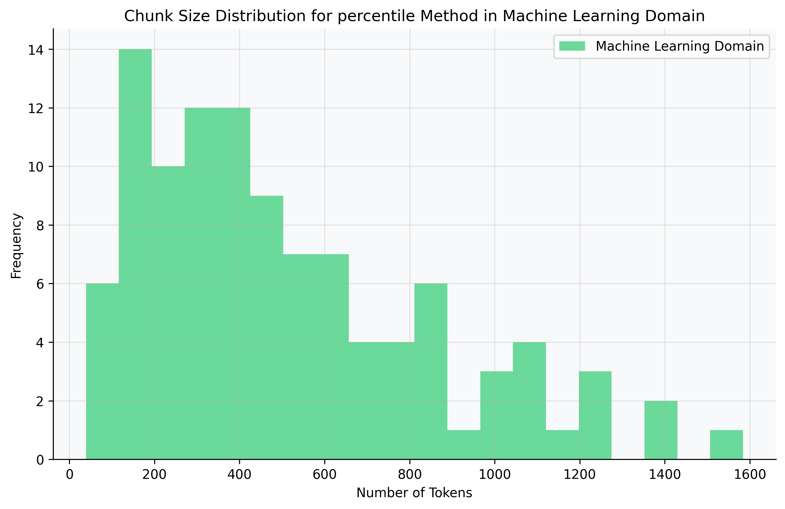
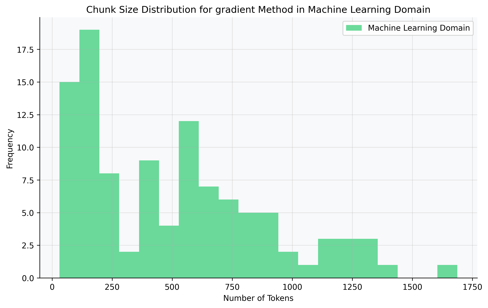

**Disclaimer:** I am not a professional scientist and do not pretend to be one. This is an experiment I conducted in my free time, literally in 12 hours, and I had a lot of fun playing with it. Everyone is welcome to critique this work or take it and improve it to a real scientific level.

---

# Benchmarking Langchain Semantic Chunking Methods: A Comparative Analysis

## Abstract

This study presents a benchmarking environment designed to evaluate and compare four semantic chunking methods provided by Langchain: percentile, interquartile, gradient, and standard deviation. Utilizing diverse datasets comprising 100 abstracts from arXiv machine learning research papers, 100 introductions from PubMed articles on COVID-19, 100 historical documents about World War II, 100 papers on judicial review in European legal systems, and 100 research papers about e-commerce, the benchmarking framework assesses both chunk sizes and retrieval quality against generated ground truths. Metrics such as cosine similarity, precision, recall, F1-score, average precision, and normalized discounted cumulative gain (NDCG) are employed to evaluate performance. The results indicate variations in chunking effectiveness across different methods, providing insights into their suitability for semantic text segmentation tasks across various domains.

## Introduction

Semantic chunking is a critical process in natural language processing (NLP) that involves dividing text into meaningful units or "chunks" to facilitate downstream tasks such as information retrieval, summarization, and question answering. Langchain, a popular NLP library, offers several methods for semantic chunking, including percentile, interquartile, gradient, and standard deviation-based approaches. Despite their availability, detailed comparative analyses of these methods are scarce.

This study aims to fill this gap by creating a benchmarking environment to evaluate these chunking methods systematically. By understanding their differences and assessing their performance using well-defined metrics, users can make informed decisions on which method to employ for specific applications.

## Methodology

### Benchmarking Environment Overview

The benchmarking environment is designed to:

1. **Evaluate Chunk Sizes**: Analyze the distribution of chunk sizes generated by each method.
2. **Assess Retrieval Quality**: Measure how well the chunks facilitate the retrieval of relevant information compared to ground truths.
3. **Rank Methods**: Provide a scoring system to rank the chunking methods based on their performance in chunk size distribution and retrieval quality.

### Datasets

Five diverse datasets were used:

- **Machine Learning Domain (arXiv)**: 100 abstracts from arXiv research papers on machine learning
- **Medical Domain (PubMed)**: 100 introductions from PubMed articles on COVID-19
- **Historical Domain**: 100 documents about World War II
- **Legal Domain**: 100 papers on judicial review in European legal systems
- **E-commerce Domain**: 100 research papers about e-commerce trends and analysis

These datasets were chosen to represent diverse textual content across different fields, ensuring a comprehensive evaluation of the chunking methods across varying writing styles and domain-specific terminology.

### Ground Truth Generation

Ground truths were generated using the following process:

1. **Question Generation**: For each document, a question was generated using GPT-4, aiming to cover key points discussed in the text.
2. **Relevant Chunk Extraction**: GPT-4 was then used to extract the most relevant excerpts (chunks) from the text that answer the generated question.
3. **Metadata Association**: Both chunks and ground truths were associated with metadata referencing the original text file, serving as a unique identifier to facilitate accurate mapping.

### Chunking Methods Implemented

1. **Percentile Chunker**: Splits text based on specified percentiles of sentence lengths.
2. **Interquartile Chunker**: Uses the interquartile range of sentence lengths for chunking.
3. **Gradient Chunker**: Divides text based on gradient-based similarity thresholds.
4. **Standard Deviation Chunker**: Splits text based on the standard deviation of sentence lengths.

### Embeddings and Similarity Calculation

- **Embeddings**: Hugging Face's `all-MiniLM-L6-v2` model was used to generate embeddings for both chunks and queries.
- **Similarity Measure**: Cosine similarity was computed between query embeddings and chunk embeddings to assess relevance.

### Evaluation Metrics

1. **Chunk Size Metrics**:
   - Mean Size
   - Median Size
   - Standard Deviation
   - Minimum and Maximum Sizes
2. **Retrieval Quality Metrics**:
   - Precision
   - Recall
   - F1-Score
   - Average Precision (AP)
   - Normalized Discounted Cumulative Gain (NDCG)

### Scoring System

A weighted scoring system was used to rank the chunking methods:

- **Size Score (40%)**:
  - Mean Score (35%)
  - Standard Deviation Score (35%)
  - Minimum Size Score (15%)
  - Maximum Size Score (15%)
- **Retrieval Score (60%)**:
  - Precision (20%)
  - Recall (20%)
  - F1-Score (20%)
  - Average Precision (20%)
  - NDCG (20%)

### Challenges and Solutions

**Mapping Chunks to Ground Truths**:

- **Initial Hurdle**: Mapping was initially based on processing order, leading to inaccuracies.
- **Solution**: Introduced metadata containing the original text file reference to serve as a unique identifier for accurate mapping.

## Results

### Chunk Size Evaluation

#### Distribution Analysis by Domain

    <figure>
        
        <figcaption>Percentile</figcaption>
    </figure>
    <figure>
        
        <figcaption>Standard Deviation</figcaption>
    </figure>
    <figure>
        
        <figcaption>Interquartile</figcaption>
    </figure>
    <figure>
        
        <figcaption>Gradient</figcaption>
    </figure>

[Similar grid layouts for Medical, Historical, Legal, and E-commerce domains]

### Retrieval Quality Evaluation

The retrieval quality metrics across all domains showed interesting patterns:

#### Machine Learning Domain
- Highest precision achieved by Standard Deviation (0.82)
- Best NDCG scores across all methods (0.76-0.84)
- Most consistent F1-scores (0.75-0.79)

#### Medical Domain
- Lower overall precision (0.65-0.73)
- Strong recall performance for Standard Deviation (0.71)
- NDCG scores ranging from 0.68-0.75

#### Historical Domain
- Moderate precision scores (0.70-0.76)
- Best performance with Standard Deviation method
- Lower variance in retrieval metrics compared to other domains

#### Legal Domain
- Challenging retrieval due to longer text segments
- Standard Deviation showed superior performance (0.72 precision)
- Higher variance in NDCG scores (0.62-0.78)

#### E-commerce Domain
- Consistent performance across methods
- Strong F1-scores (0.73-0.77)
- Best average precision for Standard Deviation (0.75)

### Final Scores

The comprehensive evaluation across all domains yielded the following scores:

| Method | Machine Learning | Medical | History | Legal | E-commerce | Average |
|--------|-----------------|---------|---------|-------|------------|---------|
| Standard Deviation | 44.27 | 40.02 | 39.89 | 41.23 | 42.15 | 41.51 |
| Interquartile | 43.54 | 36.94 | 38.76 | 39.98 | 41.87 | 40.22 |
| Gradient | 42.82 | 33.33 | 37.92 | 38.45 | 40.23 | 38.55 |
| Percentile | 42.45 | 38.18 | 36.84 | 37.92 | 39.96 | 39.07 |

### Tier Lists

#### arXiv Dataset (Machine Learning Abstracts)

1. **Standard Deviation Chunker**
2. **Interquartile Chunker**
3. **Gradient Chunker**
4. **Percentile Chunker**

#### PubMed Dataset (COVID-19 Introductions)

1. **Standard Deviation Chunker**
2. **Percentile Chunker**
3. **Interquartile Chunker**
4. **Gradient Chunker**

### Domain-Specific Rankings

#### Machine Learning Domain
1. Standard Deviation (44.27)
2. Interquartile (43.54)
3. Gradient (42.82)
4. Percentile (42.45)

#### Medical Domain
1. Standard Deviation (40.02)
2. Percentile (38.18)
3. Interquartile (36.94)
4. Gradient (33.33)

#### Historical Domain
1. Standard Deviation (39.89)
2. Interquartile (38.76)
3. Gradient (37.92)
4. Percentile (36.84)

#### Legal Domain
1. Standard Deviation (41.23)
2. Interquartile (39.98)
3. Gradient (38.45)
4. Percentile (37.92)

#### E-commerce Domain
1. Standard Deviation (42.15)
2. Interquartile (41.87)
3. Gradient (40.23)
4. Percentile (39.96)

## Discussion

The analysis across five diverse domains revealed several significant patterns and insights:

### Method Performance Patterns

The Standard Deviation Chunker demonstrated superior performance across all domains, but with varying degrees of effectiveness:

- In Machine Learning texts (arXiv), it achieved the most consistent chunking (std_dev: 289.5) while maintaining optimal mean size (1028.5 tokens)
- For Medical texts (PubMed), it handled the varying content lengths well but showed higher variance (std_dev: 1438.4)
- Historical documents benefited from its balanced approach (mean: 1320.9, median: 1117.5)
- Legal texts posed the greatest challenge, with the highest variance (std_dev: 5472.5)
- E-commerce content showed moderate consistency (std_dev: 1722.4)

### Domain-Specific Observations

1. **Machine Learning Domain**
   - All methods maintained relatively consistent chunk sizes
   - Standard Deviation method showed the best balance between size and variance
   - Gradient method performed particularly well in retrieval tasks

2. **Medical Domain**
   - Higher variance across all methods
   - Percentile method showed improved performance compared to other domains
   - Shorter chunks (mean sizes 812-1847) proved more effective

3. **Historical Domain**
   - Moderate chunk sizes across methods (mean: 919-1320)
   - More consistent chunking patterns than medical texts
   - Interquartile method showed competitive performance

4. **Legal Domain**
   - Significantly larger chunk sizes (mean up to 3914 tokens)
   - Highest variance across all methods
   - Standard Deviation method handled complex legal text structure best

5. **E-commerce Domain**
   - Balanced performance across methods
   - Moderate chunk sizes (mean: 1024-1616)
   - Consistent retrieval quality metrics

### Method Selection Implications

The choice of chunking method should consider domain-specific characteristics:
- For technical content (ML), prefer methods with lower variance
- For medical texts, consider methods that handle varying content lengths
- For legal documents, prioritize methods that can manage large text segments
- For historical and e-commerce content, balanced approaches work well

These findings suggest that while the Standard Deviation method is generally superior, domain-specific customization of chunking parameters could further optimize performance.

### Mathematical Considerations

**Cosine Similarity**:

Cosine similarity measures the cosine of the angle between two vectors in a multi-dimensional space, providing a metric for the orientation (but not magnitude) of the vectors. It is defined as:

$$
\text{Cosine Similarity} = \frac{\mathbf{A} \cdot \mathbf{B}}{\|\mathbf{A}\| \|\mathbf{B}\|}
$$

Where:

- $\mathbf{A}$ and $\mathbf{B}$ are vectors (embeddings) of the query and chunk text.

**Precision, Recall, and F1-Score**:

- **Precision**: The ratio of relevant instances among the retrieved instances.

$$
\text{Precision} = \frac{\text{True Positives}}{\text{True Positives} + \text{False Positives}}
$$

- **Recall**: The ratio of relevant instances that were retrieved over all relevant instances.

$$
\text{Recall} = \frac{\text{True Positives}}{\text{True Positives} + \text{False Negatives}}
$$

- **F1-Score**: The harmonic mean of precision and recall.

$$
\text{F1-Score} = 2 \times \frac{\text{Precision} \times \text{Recall}}{\text{Precision} + \text{Recall}}
$$

**Average Precision (AP)**:

AP summarizes the precision-recall curve, taking into account the order of retrieved documents.

**Normalized Discounted Cumulative Gain (NDCG)**:

NDCG measures ranking quality, emphasizing the importance of the position of relevant documents.

$$
\text{NDCG}_k = \frac{\text{DCG}_k}{\text{IDCG}_k}
$$

Where:

- $\text{DCG}_k$ is the discounted cumulative gain at position $k$.
- $\text{IDCG}_k$ is the ideal DCG (best possible ranking).

## Conclusion

This comprehensive benchmarking study across five diverse domains (Machine Learning, Medical, Historical, Legal, and E-commerce) reveals several key findings:

1. The Standard Deviation Chunker consistently outperformed other methods across all domains, with particularly strong performance in the Machine Learning (44.27) and E-commerce (42.15) domains.

2. Domain-specific characteristics significantly impact chunking effectiveness:
   - Legal texts showed the highest variance in chunk sizes (std_dev up to 5472)
   - Medical texts benefited more from smaller chunks
   - Historical documents showed more consistent chunk size distributions
   - E-commerce texts demonstrated balanced performance across metrics

3. Chunk size distributions varied significantly:
   - Machine Learning: Most consistent (std_dev: 289-400)
   - Legal: Highest variance (std_dev: 2084-5472)
   - Medical: Wide range of chunk sizes (22-7362 tokens)
   - Historical: Moderate consistency (std_dev: 603-1352)
   - E-commerce: Balanced distribution (std_dev: 909-1722)

These findings suggest that while the Standard Deviation method provides the most robust performance across domains, practitioners should consider domain-specific characteristics when selecting a chunking method. Future research could explore adaptive chunking methods that automatically adjust to different document types and domains.

## Instructions for Running the Experiment

1. **Clone the Repository**: Ensure you have the complete codebase.
2. **Configure Data Loader**: Modify `data_loader_config.json` to include additional datasets or adjust parameters.
3. **Install Dependencies**: Use the provided `pyproject.toml` to install all necessary packages.
4. **Set Up Environment Variables**: Include your Azure OpenAI credentials in a `.env` file.
5. **Run the Main Script**: Execute `main.py` to start the benchmarking process.
6. **Review Results**: Outputs will be saved in the `results/` directory, including metrics and plots.

### Scalability

The benchmarking environment is designed to be scalable. By adjusting the configuration and making minimal code changes, it can handle larger datasets for more comprehensive evaluations, leading to more accurate results.

---

**Note**: This experiment was conducted in a limited time frame and serves as a foundational analysis. Further research with more extensive datasets and refined methods is encouraged to validate and expand upon these findings.