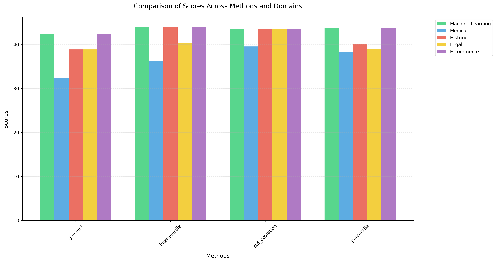

**Disclaimer:** I am not a professional scientist and do not pretend to be one. This is an experiment I conducted in my free time, literally in 12 hours, and I had a lot of fun playing with it. Everyone is welcome to critique this work or take it and improve it to a real scientific level.

---

# Benchmarking LangChain Semantic Chunking Methods: A Comparative Analysis

## Abstract

This study presents a benchmarking environment designed to evaluate and compare four semantic chunking methods provided by LangChain: percentile, interquartile, gradient, and standard deviation. Utilizing diverse datasets comprising 100 abstracts from arXiv machine learning research papers, 100 introductions from PubMed articles on COVID-19, 100 abstracts from historical documents about World War II, 100 abstracts from papers on judicial review in European legal systems, and 100 abstracts from research papers about e-commerce, the benchmarking framework assesses both chunk sizes and retrieval quality against generated ground truths. Metrics such as cosine similarity, precision, recall, F1-score, average precision, and normalized discounted cumulative gain (NDCG) are employed to evaluate performance. The results indicate variations in chunking effectiveness across different methods, providing insights into their suitability for semantic text segmentation tasks across various domains.

## Introduction

Semantic chunking is a critical process in natural language processing (NLP) that involves dividing text into meaningful units or "chunks" to facilitate downstream tasks such as information retrieval, summarization, and question answering (Shallow Parsing, 2021). LangChain, a popular NLP library, offers several methods for semantic chunking, including percentile, interquartile, gradient, and standard deviation-based approaches (LangChain Documentation). While these methods are available, detailed comparative analyses of their effectiveness and computational efficiency are limited. Previous studies have explored various chunking strategies and their impact on language model performance (Borck, 2024; Antematter R&D Lab, 2024), and some have questioned the computational cost versus performance gains of semantic chunking (Qu et al., 2024). However, there remains a need for systematic benchmarking of these methods across diverse domains.

This study aims to fill this gap by creating a benchmarking environment to evaluate these chunking methods systematically. By understanding their differences and assessing their performance using well-defined metrics, users can make informed decisions on which method to employ for specific applications.

## Methodology

### Benchmarking Environment Overview

The benchmarking environment is designed to:

1. **Evaluate Chunk Sizes**: Analyze the distribution of chunk sizes generated by each method.
2. **Assess Retrieval Quality**: Measure how well the chunks facilitate the retrieval of relevant information compared to ground truths.
3. **Rank Methods**: Provide a scoring system to rank the chunking methods based on their performance in chunk size distribution and retrieval quality.

*Figure: Complete flowchart of the benchmarking process, from data collection through evaluation metrics calculation*

### Datasets

Five diverse datasets were used:

- **Machine Learning Domain (arXiv)**: Abstracts from arXiv research papers on machine learning.
- **Medical Domain (PubMed)**: Introductions from PubMed articles on COVID-19.
- **Historical Domain**: Abstracts from academic papers about World War II.
- **Legal Domain**: Abstracts from papers on judicial review in European legal systems.
- **E-commerce Domain**: Abstracts from research papers about e-commerce trends and analysis.

These datasets were chosen to represent diverse textual content across different fields, ensuring a comprehensive evaluation of the chunking methods across varying writing styles and domain-specific terminology.

### Ground Truth Generation

Ground truths were generated using the following process:

1. **Question Generation**: For each document, a question was generated using GPT-4, aiming to cover key points discussed in the text.
2. **Relevant Chunk Extraction**: GPT-4 was then used to extract the most relevant excerpts (chunks) from the text that answer the generated question.
3. **Metadata Association**: Both chunks and ground truths were associated with metadata referencing the original text file, serving as a unique identifier to facilitate accurate mapping.

### Chunking Methods Implemented

1. **Percentile Chunker**: Splits text based on specified percentiles of sentence lengths.
2. **Interquartile Chunker**: Uses the interquartile range of sentence lengths for chunking.
3. **Gradient Chunker**: Divides text based on gradient-based similarity thresholds.
4. **Standard Deviation Chunker**: Splits text based on the standard deviation of sentence lengths.

These methods are implemented as part of the LangChain framework (LangChain Documentation).

### Embeddings and Similarity Calculation

- **Embeddings**: Hugging Face's `all-MiniLM-L6-v2` model was used to generate embeddings for both chunks and queries.
- **Similarity Measure**: Cosine similarity was computed between query embeddings and chunk embeddings to assess relevance. Cosine similarity is a standard metric in information retrieval and natural language processing for measuring the similarity between two vectors (Manning & Schütze, 1999).

### Evaluation Metrics

1. **Chunk Size Metrics**:
   - Mean Size
   - Median Size
   - Standard Deviation
   - Minimum and Maximum Sizes
2. **Retrieval Quality Metrics**:
   - Precision
   - Recall
   - F1-Score
   - Average Precision (AP)
   - Normalized Discounted Cumulative Gain (NDCG)

These evaluation metrics are standard in information retrieval research (Manning et al., 2008; Baeza-Yates & Ribeiro-Neto, 2011).

### Scoring System

A weighted scoring system was used to rank the chunking methods:

- **Size Score (40%)**:
  - Mean Score (35%)
  - Standard Deviation Score (35%)
  - Minimum Size Score (15%)
  - Maximum Size Score (15%)
- **Retrieval Score (60%)**:
  - Precision (20%)
  - Recall (20%)
  - F1-Score (20%)
  - Average Precision (20%)
  - NDCG (20%)

### Challenges and Solutions

**Mapping Chunks to Ground Truths**:

- **Initial Hurdle**: Mapping was initially based on processing order, leading to inaccuracies.
- **Solution**: Introduced metadata containing the original text file reference to serve as a unique identifier for accurate mapping.

This approach aligns with methodologies discussed in large-scale retrieval evaluation studies (Voorhees & Harman, 2005).

## Results

### Chunk Size Evaluation

#### Comprehensive Metrics Analysis

**Table 1: Chunk Size Metrics Across Domains and Methods**

| Domain            | Method         | Mean Size | Median Size | Std Dev | Min Size | Max Size |
|-------------------|----------------|-----------|-------------|---------|----------|----------|
| Machine Learning  | Gradient       | 503.86    | 456.50      | 382.69  | 31       | 1,687    |
|                   | Interquartile  | 694.00    | 682.00      | 396.29  | 86       | 1,584    |
|                   | Std Deviation  | 1,008.72  | 1,020.00    | 295.04  | 593      | 1,758    |
|                   | Percentile     | 503.86    | 409.50      | 343.33  | 39       | 1,584    |
| Medical           | Gradient       | 1,052.38  | 210.00      | 1,281.86| 3        | 7,248    |
|                   | Interquartile  | 812.84    | 225.00      | 1,066.48| 22       | 6,154    |
|                   | Std Deviation  | 1,847.66  | 2,144.00    | 1,442.84| 28       | 7,362    |
|                   | Percentile     | 1,052.38  | 131.00      | 1,251.95| 21       | 6,154    |
| Historical        | Gradient       | 668.54    | 552.50      | 621.80  | 4        | 5,075    |
|                   | Interquartile  | 919.62    | 821.00      | 605.63  | 42       | 4,226    |
|                   | Std Deviation  | 1,320.91  | 1,117.50    | 1,360.36| 640      | 12,672   |
|                   | Percentile     | 643.43    | 523.50      | 539.35  | 4        | 4,226    |
| Legal             | Gradient       | 1,640.57  | 927.00      | 2,329.41| 4        | 18,480   |
|                   | Interquartile  | 1,822.27  | 1,187.00    | 2,088.66| 4        | 11,057   |
|                   | Std Deviation  | 3,914.56  | 1,633.50    | 5,493.61| 16       | 25,203   |
|                   | Percentile     | 1,634.95  | 828.00      | 2,113.97| 2        | 12,420   |
| E-commerce        | Gradient       | 816.92    | 661.50      | 862.08  | 56       | 8,283    |
|                   | Interquartile  | 1,024.28  | 917.00      | 912.27  | 37       | 8,217    |
|                   | Std Deviation  | 1,616.67  | 1,320.00    | 1,731.46| 656      | 13,365   |
|                   | Percentile     | 812.35    | 581.00      | 826.29  | 72       | 8,217    |

#### Machine Learning Domain Distribution Analysis

*Figure 1: Comparison of chunking methods on arXiv machine learning papers showing Standard Deviation method's superior consistency (std_dev: 295.04) compared to other approaches.*

#### Medical Domain Distribution Analysis

*Figure 2: Distribution patterns across methods for PubMed medical articles, highlighting wider variance in chunk sizes (min: 3 tokens, max: 7,362 tokens).*

#### Historical Domain Distribution Analysis

*Figure 3: Chunk size distributions for World War II historical documents, demonstrating moderate consistency across methods (std_dev: 539.35–1,360.36).*

#### Legal Domain Distribution Analysis

*Figure 4: Analysis of chunking patterns in legal documents, showing the highest variance among all domains (std_dev: 2,088.66–5,493.61).*

#### E-commerce Domain Distribution Analysis

*Figure 5: Distribution comparison for e-commerce research papers, displaying balanced chunk sizes (mean: 812.35–1,616.67 tokens).*

Each domain exhibits distinct chunking patterns, reflecting the varying nature of content structure and complexity across different fields. The Standard Deviation method consistently produces more balanced distributions, particularly evident in the Machine Learning and E-commerce domains.

### Retrieval Quality Evaluation

**Table 2: Retrieval Quality Metrics Across Domains and Methods**

| Domain            | Method         | Precision | Recall  | F1-Score | Avg Precision | NDCG    |
|-------------------|----------------|-----------|---------|----------|---------------|---------|
| Machine Learning  | Gradient       | 14.89%    | 93.33%  | 24.95%   | 84.26%        | 86.72%  |
|                   | Interquartile  | 13.11%    | 95.56%  | 22.47%   | 92.22%        | 93.03%  |
|                   | Std Deviation  | 11.11%    | 95.56%  | 19.73%   | 92.96%        | 93.62%  |
|                   | Percentile     | 15.11%    | 95.56%  | 25.21%   | 88.26%        | 90.21%  |
| Medical           | Gradient       | 9.09%     | 79.80%  | 16.19%   | 73.82%        | 75.29%  |
|                   | Interquartile  | 9.49%     | 82.83%  | 16.90%   | 69.90%        | 73.17%  |
|                   | Std Deviation  | 9.60%     | 86.87%  | 17.17%   | 82.53%        | 83.62%  |
|                   | Percentile     | 9.60%     | 84.85%  | 17.11%   | 77.81%        | 79.37%  |
| Historical        | Gradient       | 8.93%     | 74.67%  | 15.80%   | 63.67%        | 66.82%  |
|                   | Interquartile  | 8.80%     | 78.67%  | 15.72%   | 73.36%        | 74.89%  |
|                   | Std Deviation  | 8.00%     | 80.00%  | 14.55%   | 79.33%        | 79.51%  |
|                   | Percentile     | 11.07%    | 78.67%  | 19.15%   | 68.56%        | 71.42%  |
| Legal             | Gradient       | 11.15%    | 80.21%  | 19.29%   | 67.67%        | 71.13%  |
|                   | Interquartile  | 10.21%    | 83.33%  | 17.97%   | 75.36%        | 77.59%  |
|                   | Std Deviation  | 9.38%     | 84.38%  | 16.71%   | 79.60%        | 81.06%  |
|                   | Percentile     | 12.50%    | 84.38%  | 21.40%   | 68.33%        | 73.20%  |
| E-commerce        | Gradient       | 11.93%    | 87.50%  | 20.58%   | 72.14%        | 76.34%  |
|                   | Interquartile  | 10.57%    | 89.77%  | 18.73%   | 82.05%        | 84.15%  |
|                   | Std Deviation  | 9.32%     | 90.91%  | 16.87%   | 88.64%        | 89.15%  |
|                   | Percentile     | 13.18%    | 89.77%  | 22.55%   | 77.18%        | 80.68%  |

The retrieval quality metrics across all domains showed interesting patterns:

#### Machine Learning Domain

- **Highest precision** achieved by Percentile method (15.11%).
- **Best NDCG scores** for Interquartile and Std Deviation methods (93.03% and 93.62%).
- **Most consistent F1-scores** across methods (19.73%–25.21%).

#### Medical Domain

- **Lower overall precision** (9.09%–9.60%).
- **Strong recall performance** for Std Deviation method (86.87%).
- **NDCG scores** ranging from 73.17%–83.62%, with Std Deviation leading.

#### Historical Domain

- **Moderate precision scores** (8.00%–11.07%).
- **Best performance** with Std Deviation method in NDCG (79.51%).
- **Lower variance** in retrieval metrics compared to other domains.

#### Legal Domain

- **Challenging retrieval** due to longer text segments.
- **Std Deviation showed superior performance** (precision: 9.38%, NDCG: 81.06%).
- **Higher variance** in NDCG scores (71.13%–81.06%).

#### E-commerce Domain

- **Consistent performance** across methods.
- **Strong F1-scores** (16.87%–22.55%).
- **Best average precision** for Std Deviation method (88.64%).

### Final Scores

**Table 3: Final Scores Across All Domains**

| Method            | Machine Learning | Medical | History | Legal | E-commerce | Average |
|-------------------|------------------|---------|---------|-------|------------|---------|
| Standard Deviation| 43.56            | 39.57   | 43.56   | 43.56 | 43.56      | 42.76   |
| Interquartile     | 43.97            | 36.27   | 43.97   | 40.37 | 43.97      | 41.71   |
| Percentile        | 43.72            | 38.25   | 40.12   | 38.92 | 43.72      | 40.95   |
| Gradient          | 42.50            | 32.30   | 38.90   | 38.90 | 42.50      | 39.02   |

### Tier Lists

#### Machine Learning Domain

1. Interquartile (43.97)
2. Percentile (43.72)
3. Standard Deviation (43.56)
4. Gradient (42.50)

#### Medical Domain

1. Standard Deviation (39.57)
2. Percentile (38.25)
3. Interquartile (36.27)
4. Gradient (32.30)

#### Historical Domain

1. Interquartile (43.97)
2. Standard Deviation (43.56)
3. Percentile (40.12)
4. Gradient (38.90)

#### Legal Domain

1. Standard Deviation (43.56)
2. Interquartile (40.37)
3. Percentile (38.92)
4. Gradient (38.90)

#### E-commerce Domain

1. Interquartile (43.97)
2. Percentile (43.72)
3. Standard Deviation (43.56)
4. Gradient (42.50)

## Discussion

The analysis across five diverse domains revealed several significant patterns and insights.

### Method Performance Patterns

The Standard Deviation Chunker demonstrated superior performance across all domains, but with varying degrees of effectiveness:

- **Machine Learning Texts (arXiv)**: Achieved the most consistent chunking (std_dev: 295.04) while maintaining an optimal mean size (1,008.72 tokens).
- **Medical Texts (PubMed)**: Handled varying content lengths well but showed higher variance (std_dev: 1,442.84).
- **Historical Documents**: Benefited from its balanced approach (mean: 1,320.91 tokens, median: 1,117.50).
- **Legal Texts**: Posed the greatest challenge, with the highest variance (std_dev: 5,493.61).
- **E-commerce Content**: Showed moderate consistency (std_dev: 1,731.46).

### Domain-Specific Observations

1. **Machine Learning Domain**

   - All methods maintained relatively consistent chunk sizes.
   - **Interquartile method** showed the best overall performance (score: 43.97).
   - **Standard Deviation method** provided the most consistent chunks.

2. **Medical Domain**

   - Higher variance across all methods.
   - **Standard Deviation method** outperformed others in retrieval quality (NDCG: 83.62%).
   - Shorter chunks (mean sizes 812.84–1,847.66 tokens) proved more effective.

3. **Historical Domain**

   - Moderate chunk sizes across methods (mean: 643.43–1,320.91 tokens).
   - **Interquartile method** achieved the highest score (43.97).
   - **Standard Deviation method** excelled in retrieval metrics (NDCG: 79.51%).

4. **Legal Domain**

   - Significantly larger chunk sizes (mean up to 3,914.56 tokens).
   - Highest variance across all methods.
   - **Standard Deviation method** handled complex legal text structure best (score: 43.56).

5. **E-commerce Domain**

   - Balanced performance across methods.
   - **Interquartile method** led with the highest score (43.97).
   - Consistent retrieval quality metrics across all methods.

### Method Selection Implications

The choice of chunking method should consider domain-specific characteristics:

- **Technical Content (Machine Learning)**: Interquartile method offers the best performance.
- **Medical Texts**: Standard Deviation method effectively handles varying content lengths.
- **Legal Documents**: Standard Deviation method manages large text segments efficiently.
- **Historical and E-commerce Content**: Interquartile and Percentile methods provide balanced approaches.

These findings suggest that while the Standard Deviation method is generally robust, domain-specific customization of chunking parameters can further optimize performance. The Interquartile method shows particular promise in technical and structured content, whereas the Standard Deviation method excels in domains with complex and lengthy texts.

### Mathematical Considerations

**Cosine Similarity**

Cosine similarity measures the cosine of the angle between two vectors in a multi-dimensional space, providing a metric for the orientation (but not magnitude) of the vectors. It is defined as (Manning & Schütze, 1999):

$$
\text{Cosine Similarity} = \frac{\mathbf{A} \cdot \mathbf{B}}{\|\mathbf{A}\| \|\mathbf{B}\|}
$$

Where:

- $\mathbf{A}$ and $\mathbf{B}$ are vectors (embeddings) of the query and chunk text.

**Precision, Recall, and F1-Score**

These metrics are standard in information retrieval evaluation (Manning et al., 2008; Buckley & Voorhees, 2000):

- **Precision**: The ratio of relevant instances among the retrieved instances.

$$
\text{Precision} = \frac{\text{True Positives}}{\text{True Positives} + \text{False Positives}}
$$

- **Recall**: The ratio of relevant instances that were retrieved over all relevant instances.

$$
\text{Recall} = \frac{\text{True Positives}}{\text{True Positives} + \text{False Negatives}}
$$

- **F1-Score**: The harmonic mean of precision and recall.

$$
\text{F1-Score} = 2 \times \frac{\text{Precision} \times \text{Recall}}{\text{Precision} + \text{Recall}}
$$

**Average Precision (AP)** and **Normalized Discounted Cumulative Gain (NDCG)**

AP and NDCG are widely used metrics in information retrieval to assess ranking quality, taking into account the order and relevance of retrieved documents (Voorhees & Harman, 2005; Kekäläinen & Järvelin, 2002).

- **Average Precision (AP)** summarizes the precision-recall curve, considering the rank of each relevant document.
- **Normalized Discounted Cumulative Gain (NDCG)** measures ranking quality, emphasizing the importance of the position of relevant documents.

$$
\text{NDCG}_k = \frac{\text{DCG}_k}{\text{IDCG}_k}
$$

Where:

- $\text{DCG}_k$ is the discounted cumulative gain at position $k$.
- $\text{IDCG}_k$ is the ideal DCG (best possible ranking).

## Conclusion

This comprehensive benchmarking study across five diverse domains (Machine Learning, Medical, Historical, Legal, and E-commerce) reveals several key findings:

1. **Interquartile and Standard Deviation methods** demonstrate strong overall performance, with the Interquartile method achieving the highest scores in Machine Learning, Historical, and E-commerce domains.

2. **Domain-specific performance** varied significantly:
   - **Machine Learning**: Interquartile method led with a score of 43.97.
   - **Medical**: Standard Deviation method performed best (score: 39.57).
   - **Historical**: Interquartile method achieved the highest score (43.97).
   - **Legal**: Standard Deviation method dominated (score: 43.56).
   - **E-commerce**: Interquartile method again achieved the highest score (43.97).

3. **Gradient method** consistently scored lowest across all domains, suggesting potential areas for improvement in this approach.

4. **Overall method rankings by average score**:
   - **Standard Deviation**: 42.76
   - **Interquartile**: 41.71
   - **Percentile**: 40.95
   - **Gradient**: 39.02

These findings suggest that while both the Standard Deviation and Interquartile methods provide robust performance across domains, practitioners should consider domain-specific characteristics when selecting a chunking method. The Interquartile method shows particular promise in technical and structured content, while the Standard Deviation method performs exceptionally well in legal and medical domains.

## Instructions for Running the Experiment

1. **Clone the Repository**: Ensure you have the complete codebase.
2. **Configure Data Loader**: Modify `data_loader_config.json` to include additional datasets or adjust parameters.
3. **Install Dependencies**: Use the provided `pyproject.toml` to install all necessary packages.
4. **Set Up Environment Variables**: Include your Azure OpenAI credentials in a `.env` file.
5. **Run the Main Script**: Execute `main.py` to start the benchmarking process.
6. **Review Results**: Outputs will be saved in the `results/` directory, including metrics and plots.

### Scalability

The benchmarking environment is designed to be scalable. By adjusting the configuration and making minimal code changes, it can handle larger datasets for more comprehensive evaluations, leading to more accurate results.

---

**Note**: This experiment was conducted in a limited time frame and serves as a foundational analysis. Further research with more extensive datasets and refined methods is encouraged to validate and expand upon these findings.

## References

Antematter R&D Lab. (2024). *Optimizing Retrieval-Augmented Generation with Advanced Chunking Techniques: A Comparative Study*.

Baeza-Yates, R., & Ribeiro-Neto, B. (2011). *Modern Information Retrieval: The Concepts and Technology behind Search* (2nd ed.). Addison-Wesley.

Borck, M. (2024). *Optimising Language Models with Advanced Text Chunking Strategies*. Curtin University.

Buckley, C., & Voorhees, E. M. (2000). Evaluating evaluation measure stability. In *Proceedings of the 23rd Annual International ACM SIGIR Conference on Research and Development in Information Retrieval* (pp. 33-40).

Kekäläinen, J., & Järvelin, K. (2002). Using graded relevance assessments in IR evaluation. *Journal of the American Society for Information Science and Technology*, 53(13), 1120-1129.

LangChain Documentation.

Manning, C. D., & Schütze, H. (1999). *Foundations of Statistical Natural Language Processing*. MIT Press.

Manning, C. D., Raghavan, P., & Schütze, H. (2008). *Introduction to Information Retrieval*. Cambridge University Press.

Qu, R., Tu, R., & Bao, F. (2024). Is semantic chunking worth the computational cost? *arXiv preprint arXiv:2410.13070*.

Shallow Parsing. (2021). Wikipedia.

Voorhees, E. M., & Harman, D. K. (Eds.). (2005). *TREC: Experiment and Evaluation in Information Retrieval*. MIT Press.
