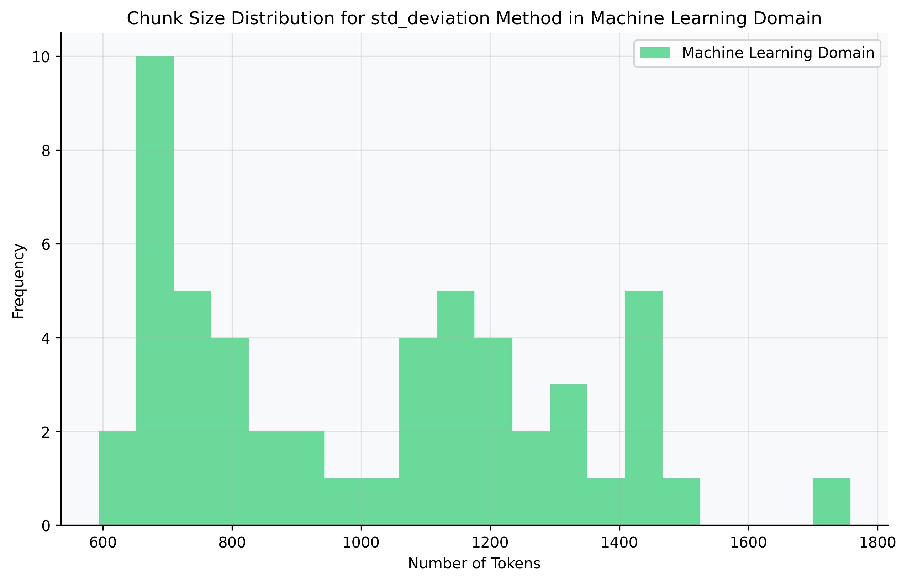
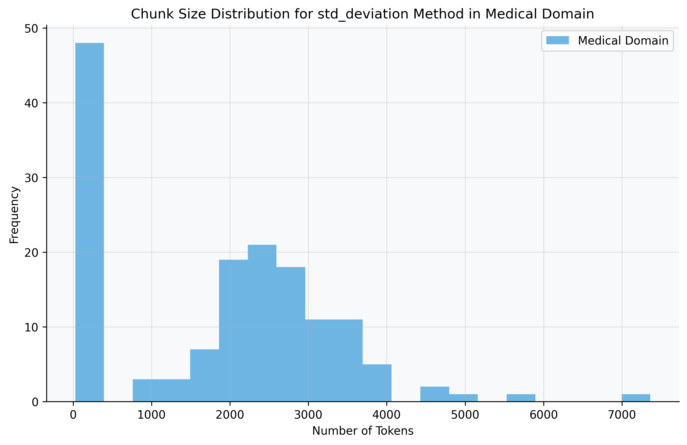
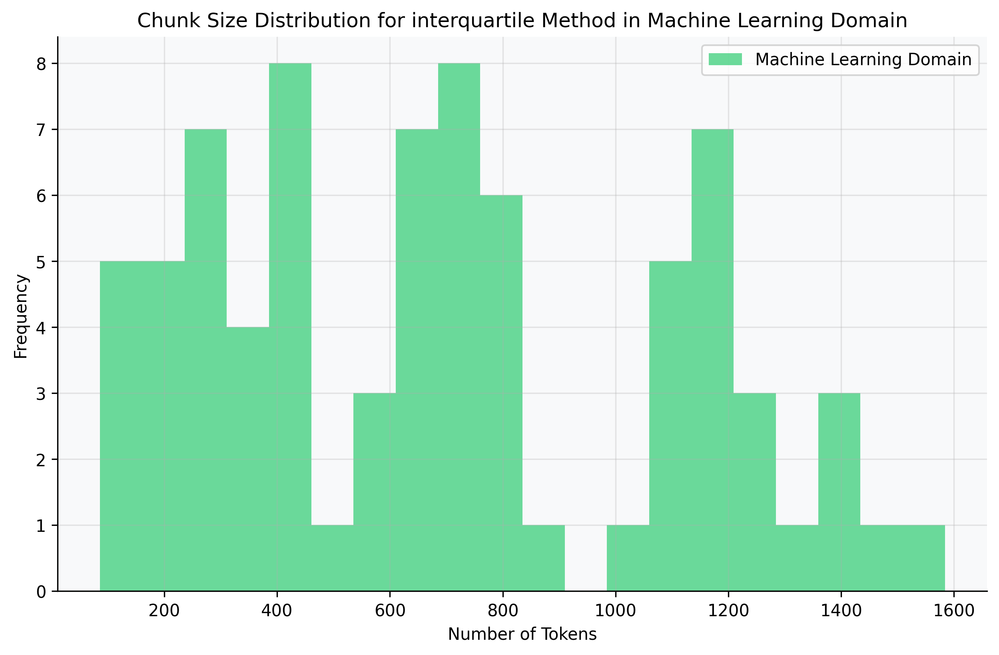
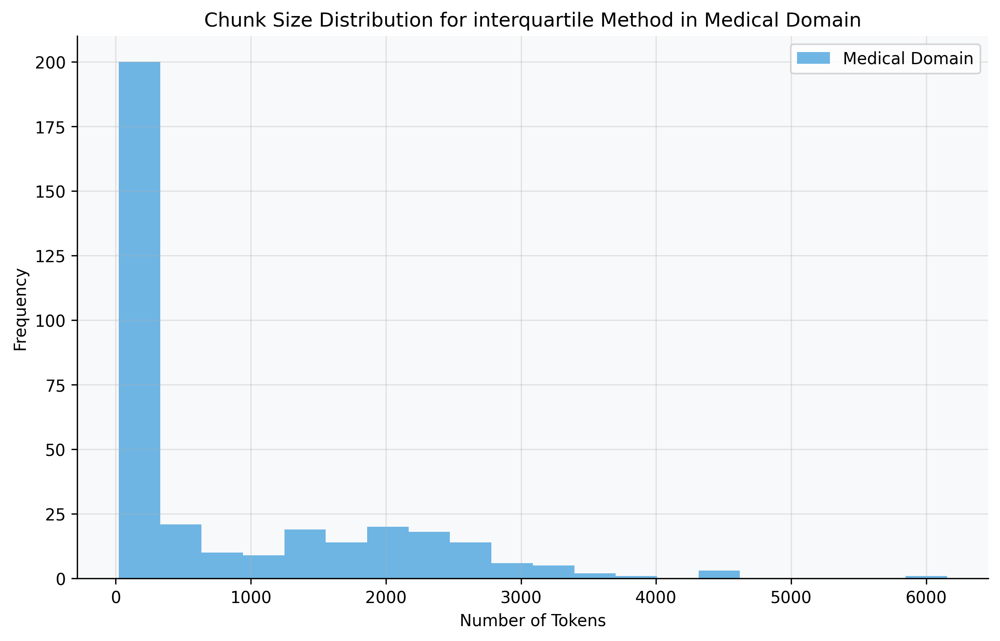
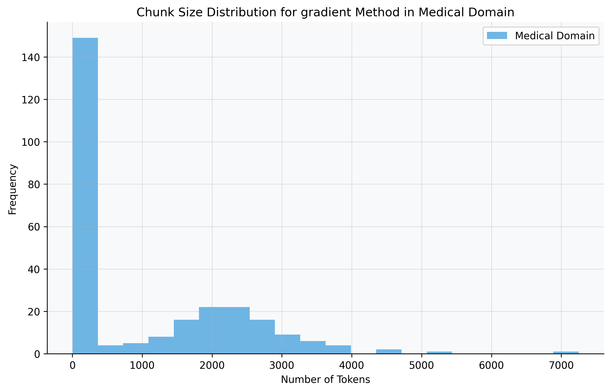

**Disclaimer:** I am not a professional scientist and do not pretend to be one. This is an experiment I conducted in my free time, literally in 12 hours, and I had a lot of fun playing with it. Everyone is welcome to critique this work or take it and improve it to a real scientific level.

---

# Benchmarking Langchain Semantic Chunking Methods: A Comparative Analysis

## Abstract

This study presents a benchmarking environment designed to evaluate and compare four semantic chunking methods provided by Langchain: percentile, interquartile, gradient, and standard deviation. Utilizing datasets comprising 100 abstracts from arXiv machine learning research papers and 100 introductions from PubMed articles on COVID-19, the benchmarking framework assesses both chunk sizes and retrieval quality against generated ground truths. Metrics such as cosine similarity, precision, recall, F1-score, average precision, and normalized discounted cumulative gain (NDCG) are employed to evaluate performance. The results indicate variations in chunking effectiveness across different methods, providing insights into their suitability for semantic text segmentation tasks in scientific and medical domains. Separate tier lists for arXiv and PubMed datasets highlight the best-performing methods in each domain.

## Introduction

Semantic chunking is a critical process in natural language processing (NLP) that involves dividing text into meaningful units or "chunks" to facilitate downstream tasks such as information retrieval, summarization, and question answering. Langchain, a popular NLP library, offers several methods for semantic chunking, including percentile, interquartile, gradient, and standard deviation-based approaches. Despite their availability, detailed comparative analyses of these methods are scarce.

This study aims to fill this gap by creating a benchmarking environment to evaluate these chunking methods systematically. By understanding their differences and assessing their performance using well-defined metrics, users can make informed decisions on which method to employ for specific applications.

## Methodology

### Benchmarking Environment Overview

The benchmarking environment is designed to:

1. **Evaluate Chunk Sizes**: Analyze the distribution of chunk sizes generated by each method.
2. **Assess Retrieval Quality**: Measure how well the chunks facilitate the retrieval of relevant information compared to ground truths.
3. **Rank Methods**: Provide a scoring system to rank the chunking methods based on their performance in chunk size distribution and retrieval quality.

### Datasets

Two datasets were used:

- **Scientific Domain (arXiv)**: 100 abstracts from arXiv research papers on machine learning.
- **Medical Domain (PubMed)**: 100 introductions from PubMed articles on COVID-19.

These datasets were chosen to represent diverse textual content in the scientific and medical fields and to limit the scope due to time and financial constraints.

### Ground Truth Generation

Ground truths were generated using the following process:

1. **Question Generation**: For each document, a question was generated using GPT-4, aiming to cover key points discussed in the text.
2. **Relevant Chunk Extraction**: GPT-4 was then used to extract the most relevant excerpts (chunks) from the text that answer the generated question.
3. **Metadata Association**: Both chunks and ground truths were associated with metadata referencing the original text file, serving as a unique identifier to facilitate accurate mapping.

### Chunking Methods Implemented

1. **Percentile Chunker**: Splits text based on specified percentiles of sentence lengths.
2. **Interquartile Chunker**: Uses the interquartile range of sentence lengths for chunking.
3. **Gradient Chunker**: Divides text based on gradient-based similarity thresholds.
4. **Standard Deviation Chunker**: Splits text based on the standard deviation of sentence lengths.

### Embeddings and Similarity Calculation

- **Embeddings**: Hugging Face's `all-MiniLM-L6-v2` model was used to generate embeddings for both chunks and queries.
- **Similarity Measure**: Cosine similarity was computed between query embeddings and chunk embeddings to assess relevance.

### Evaluation Metrics

1. **Chunk Size Metrics**:
   - Mean Size
   - Median Size
   - Standard Deviation
   - Minimum and Maximum Sizes
2. **Retrieval Quality Metrics**:
   - Precision
   - Recall
   - F1-Score
   - Average Precision (AP)
   - Normalized Discounted Cumulative Gain (NDCG)

### Scoring System

A weighted scoring system was used to rank the chunking methods:

- **Size Score (40%)**:
  - Mean Score (35%)
  - Standard Deviation Score (35%)
  - Minimum Size Score (15%)
  - Maximum Size Score (15%)
- **Retrieval Score (60%)**:
  - Precision (20%)
  - Recall (20%)
  - F1-Score (20%)
  - Average Precision (20%)
  - NDCG (20%)

### Challenges and Solutions

**Mapping Chunks to Ground Truths**:

- **Initial Hurdle**: Mapping was initially based on processing order, leading to inaccuracies.
- **Solution**: Introduced metadata containing the original text file reference to serve as a unique identifier for accurate mapping.

## Results

### Chunk Size Evaluation

The chunk size metrics for each method are presented below.

#### arXiv Dataset (Machine Learning Abstracts)

**Gradient Chunker**:

- Mean Size: 522.33
- Median Size: 491.0
- Std Dev: 395.38
- Min Size: 31
- Max Size: 1687

**Interquartile Chunker**:

- Mean Size: 723.62
- Median Size: 691
- Std Dev: 407.23
- Min Size: 86
- Max Size: 1584

**Standard Deviation Chunker**:

- Mean Size: 1045.67
- Median Size: 1071
- Std Dev: 291.92
- Min Size: 593
- Max Size: 1758

**Percentile Chunker**:

- Mean Size: 522.33
- Median Size: 433.0
- Std Dev: 355.54
- Min Size: 39
- Max Size: 1584

#### PubMed Dataset (COVID-19 Introductions)

**Gradient Chunker**:

- Mean Size: 1052.38
- Median Size: 210
- Std Dev: 1281.86
- Min Size: 3
- Max Size: 7248

**Interquartile Chunker**:

- Mean Size: 812.84
- Median Size: 225
- Std Dev: 1066.48
- Min Size: 22
- Max Size: 6154

**Standard Deviation Chunker**:

- Mean Size: 1847.66
- Median Size: 2144
- Std Dev: 1442.84
- Min Size: 28
- Max Size: 7362

**Percentile Chunker**:

- Mean Size: 1052.38
- Median Size: 131
- Std Dev: 1251.95
- Min Size: 21
- Max Size: 6154

### Retrieval Quality Evaluation

#### arXiv Dataset (Machine Learning Abstracts)

**Percentile Chunker**:

- Precision: 12.89%
- Recall: 93.33%
- F1-Score: 22.36%
- Average Precision: 86.74%
- NDCG: 88.44%

**Standard Deviation Chunker**:

- Precision: 9.78%
- Recall: 97.78%
- F1-Score: 17.78%
- Average Precision: 96.67%
- NDCG: 96.96%

**Interquartile Chunker**:

- Precision: 11.33%
- Recall: 97.78%
- F1-Score: 20.13%
- Average Precision: 90.93%
- NDCG: 92.65%

**Gradient Chunker**:

- Precision: 12.67%
- Recall: 97.78%
- F1-Score: 22.15%
- Average Precision: 85.52%
- NDCG: 88.69%

#### PubMed Dataset (COVID-19 Introductions)

**Percentile Chunker**:

- Precision: 9.60%
- Recall: 84.85%
- F1-Score: 17.11%
- Average Precision: 77.46%
- NDCG: 79.13%

**Standard Deviation Chunker**:

- Precision: 9.70%
- Recall: 87.88%
- F1-Score: 17.36%
- Average Precision: 83.77%
- NDCG: 84.82%

**Interquartile Chunker**:

- Precision: 9.80%
- Recall: 83.84%
- F1-Score: 17.39%
- Average Precision: 71.80%
- NDCG: 75.00%

**Gradient Chunker**:

- Precision: 9.29%
- Recall: 82.83%
- F1-Score: 16.59%
- Average Precision: 76.18%
- NDCG: 77.84%

### Final Scores

The final scores, combining size and retrieval metrics, are as follows:

#### arXiv Dataset (Machine Learning Abstracts)

| Method                 | Score  |
|------------------------|--------|
| **Standard Deviation** | **44.27** |
| **Interquartile**      | **43.54** |
| **Gradient**           | **42.82** |
| **Percentile**         | **42.45** |

#### PubMed Dataset (COVID-19 Introductions)

| Method                 | Score  |
|------------------------|--------|
| **Standard Deviation** | **40.02** |
| **Percentile**         | **38.18** |
| **Interquartile**      | **36.94** |
| **Gradient**           | **33.33** |

### Tier Lists

#### arXiv Dataset (Machine Learning Abstracts)

1. **Standard Deviation Chunker**
2. **Interquartile Chunker**
3. **Gradient Chunker**
4. **Percentile Chunker**

#### PubMed Dataset (COVID-19 Introductions)

1. **Standard Deviation Chunker**
2. **Percentile Chunker**
3. **Interquartile Chunker**
4. **Gradient Chunker**

## Discussion

The Standard Deviation Chunker consistently achieved the highest scores across both datasets, indicating its effectiveness in balancing chunk size distribution and retrieval quality. In the arXiv dataset, its higher mean chunk sizes and lower standard deviations suggest more uniform chunking, which may contribute to better retrieval performance.

In the PubMed dataset, while the Standard Deviation Chunker still ranked highest, the Percentile Chunker performed better than in the arXiv dataset, possibly due to differences in text structure and content between the domains.

The Gradient and Interquartile Chunkers showed competitive retrieval metrics but varied in overall scores due to differences in chunk size distributions. These findings highlight that the effectiveness of a chunking method can be domain-dependent.

### Mathematical Considerations

**Cosine Similarity**:

Cosine similarity measures the cosine of the angle between two vectors in a multi-dimensional space, providing a metric for the orientation (but not magnitude) of the vectors. It is defined as:

$$
\text{Cosine Similarity} = \frac{\mathbf{A} \cdot \mathbf{B}}{\|\mathbf{A}\| \|\mathbf{B}\|}
$$

Where:

- $\mathbf{A}$ and $\mathbf{B}$ are vectors (embeddings) of the query and chunk text.

**Precision, Recall, and F1-Score**:

- **Precision**: The ratio of relevant instances among the retrieved instances.

$$
\text{Precision} = \frac{\text{True Positives}}{\text{True Positives} + \text{False Positives}}
$$

- **Recall**: The ratio of relevant instances that were retrieved over all relevant instances.

$$
\text{Recall} = \frac{\text{True Positives}}{\text{True Positives} + \text{False Negatives}}
$$

- **F1-Score**: The harmonic mean of precision and recall.

$$
\text{F1-Score} = 2 \times \frac{\text{Precision} \times \text{Recall}}{\text{Precision} + \text{Recall}}
$$

**Average Precision (AP)**:

AP summarizes the precision-recall curve, taking into account the order of retrieved documents.

**Normalized Discounted Cumulative Gain (NDCG)**:

NDCG measures ranking quality, emphasizing the importance of the position of relevant documents.

$$
\text{NDCG}_k = \frac{\text{DCG}_k}{\text{IDCG}_k}
$$

Where:

- $\text{DCG}_k$ is the discounted cumulative gain at position $k$.
- $\text{IDCG}_k$ is the ideal DCG (best possible ranking).

## Conclusion

This benchmarking study provides a comparative analysis of four Langchain semantic chunking methods on machine learning abstracts from arXiv and COVID-19 introductions from PubMed. The Standard Deviation Chunker emerged as the most effective method in both domains, indicating its robustness across different types of scientific texts. These findings can guide practitioners in selecting appropriate chunking methods for their NLP applications in specific domains.

## Instructions for Running the Experiment

1. **Clone the Repository**: Ensure you have the complete codebase.
2. **Configure Data Loader**: Modify `data_loader_config.json` to include additional datasets or adjust parameters.
3. **Install Dependencies**: Use the provided `pyproject.toml` to install all necessary packages.
4. **Set Up Environment Variables**: Include your Azure OpenAI credentials in a `.env` file.
5. **Run the Main Script**: Execute `main.py` to start the benchmarking process.
6. **Review Results**: Outputs will be saved in the `results/` directory, including metrics and plots.

### Scalability

The benchmarking environment is designed to be scalable. By adjusting the configuration and making minimal code changes, it can handle larger datasets for more comprehensive evaluations, leading to more accurate results.

---

**Note**: This experiment was conducted in a limited time frame and serves as a foundational analysis. Further research with more extensive datasets and refined methods is encouraged to validate and expand upon these findings.